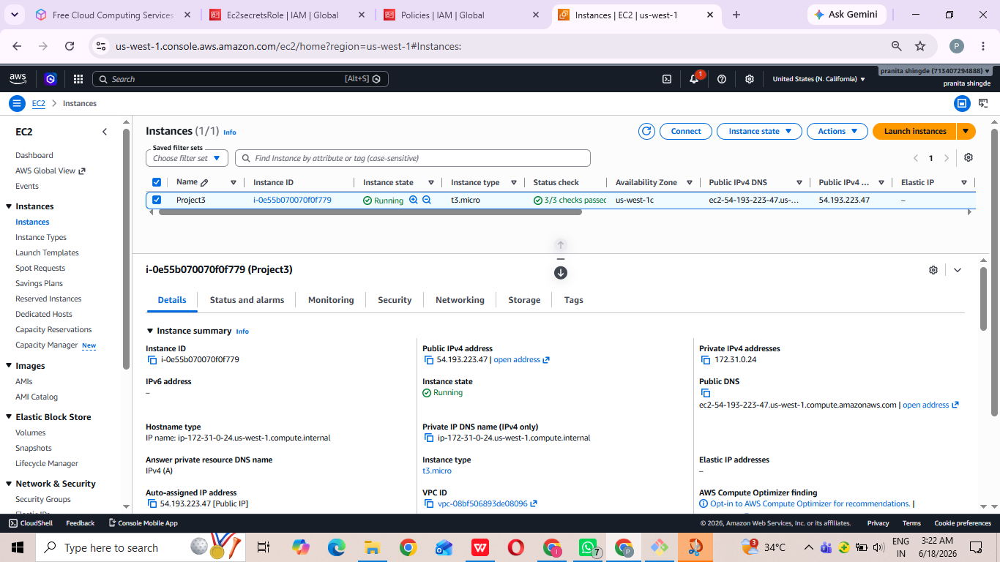
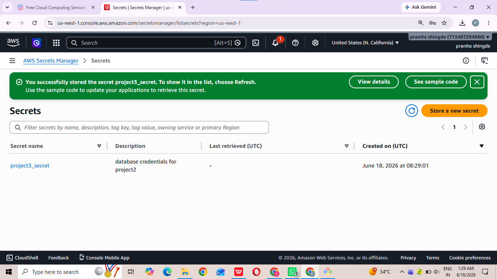
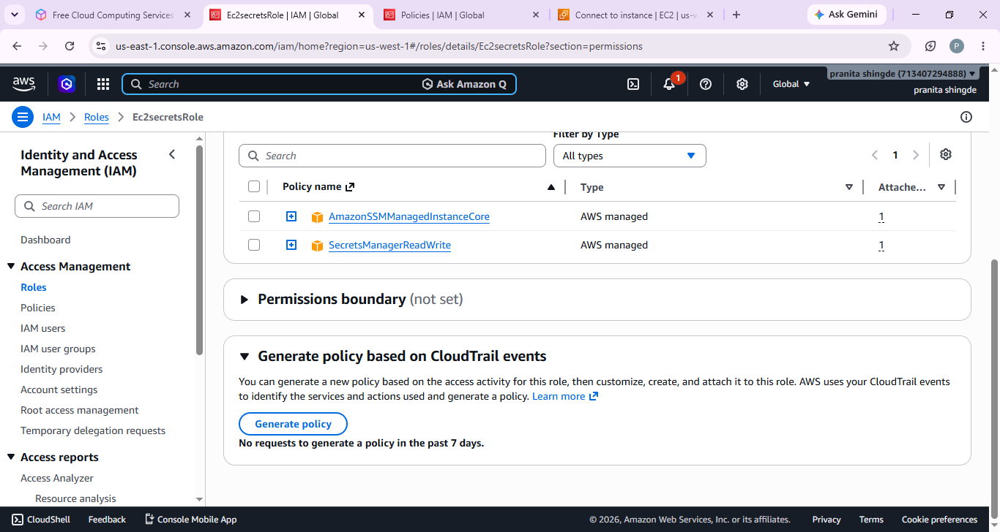
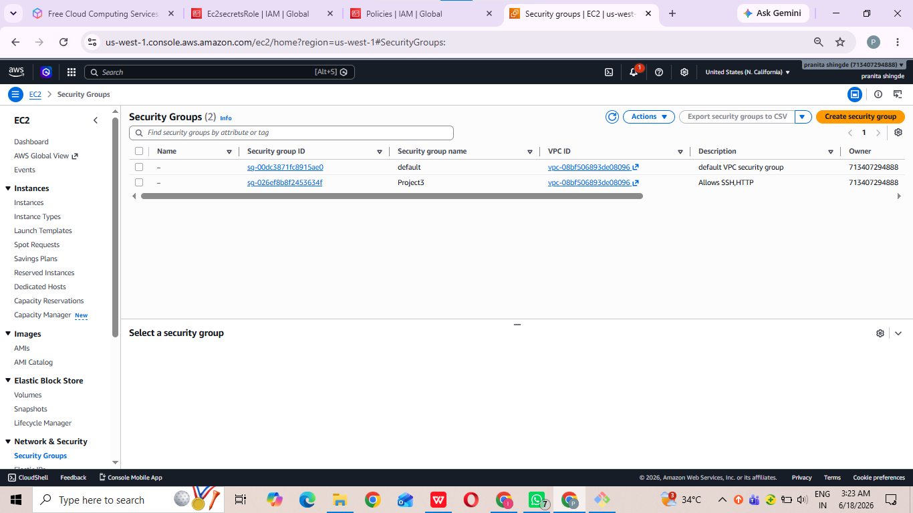
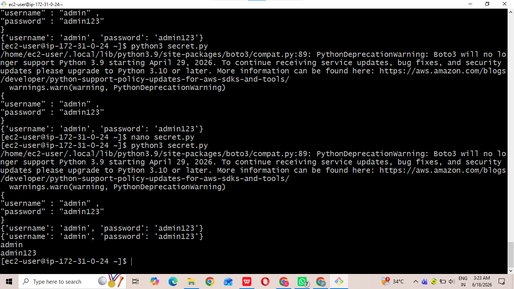

# 🚀 Project Completed: Centralized Secret Management using AWS Secrets Manager & IAM

## Project Overview

In this project, I eliminated hardcoded credentials from applications and implemented secure secret management using AWS Secrets Manager. The application dynamically retrieves secrets while access is controlled using IAM roles.

## Key Steps

• Launched EC2 Instance

• Created Sample Application

• Demonstrated Hardcoded Credentials

• Created Secrets in AWS Secrets Manager

• Stored Database Username and Password

• Created IAM Role for EC2

• Configured Least Privilege Access

• Attached IAM Role to EC2 Instance

• Modified Application to Fetch Secrets Dynamically

• Removed Hardcoded Credentials

• Verified Secure Access to Secrets

## Technologies Used

AWS EC2 | AWS Secrets Manager | IAM | Python | Security | DevSecOps

## Architecture Components

- EC2 Instance
- AWS Secrets Manager
- IAM Role
- Secure Application
- Dynamic Secret Retrieval

### EC2 Instance

### Secrets Manager Secret

### IAM Role Configuration

### Security Group

### Application Running Successfully

## Project Outcome

This project helped me understand Secret Management, IAM Security, Least Privilege Access, Credential Protection, and AWS Security Best Practices.

#AWS #DevSecOps #SecretsManager #IAM #CloudSecurity #Python #EC2